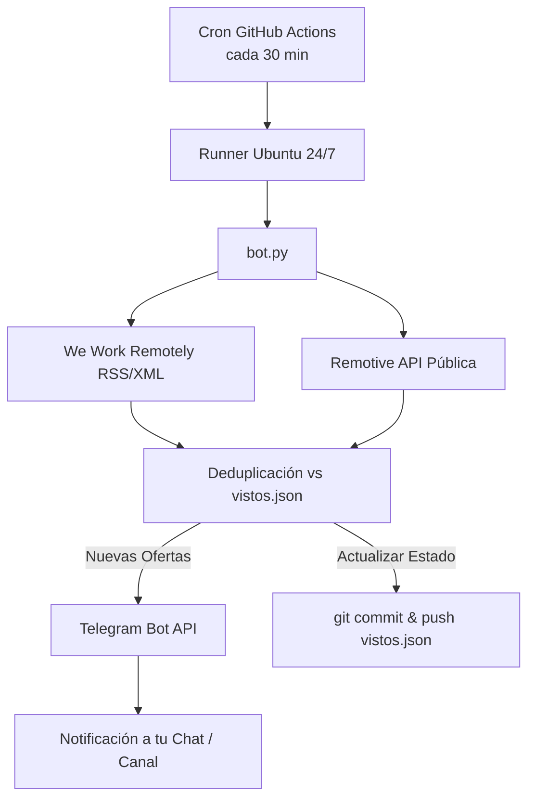

# 🚀 Job Monitor Bot (24/7 Remote Jobs Alert)

Sistema autónomo de monitoreo y notificación de vacantes remotas de ingeniería de software en tiempo real con **costo cero de infraestructura ($0/mes)**. Utiliza **GitHub Actions** para orquestación continua 24/7, **Telegram Bot API** para entrega instantánea de alertas en tu móvil o escritorio, y un archivo de estado ligero (`vistos.json`) para deduplicación automática.

---

## 🏛️ Arquitectura del Sistema



### Características Principales:
- 💰 **$0/mes de costo:** Aprovecha los minutos mensuales gratuitos de GitHub Actions y la API pública de Telegram.
- ⚡ **Alertas en tiempo real:** Formato HTML profesional con puesto, empresa, ubicación, tags y enlace directo.
- 🛡️ **Scraping resiliente:** Emplea fuentes de alta disponibilidad (RSS oficial y API abierta) sin fricción de bloqueos por Cloudflare en runners.
- 🔁 **Persistencia sin base de datos externa:** Guarda el historial de vacantes procesadas en `vistos.json` y lo confirma al repositorio mediante Git.
- ⏱️ **Rate-limiting defensivo:** Control de flujo y throttling entre mensajes para cumplir con las políticas de Telegram API.

---

## 📁 Estructura del Proyecto

```
job-monitor-bot/
├── .github/
│   └── workflows/
│       └── monitor.yml      # Workflow de GitHub Actions (Cron 24/7 y Git push)
├── bot.py                   # Scraper, gestor de estado y notificador Telegram
├── requirements.txt         # Dependencias exactas (requests, bs4, python-dotenv)
├── vistos.json              # Registro persistente de ofertas ya notificadas
├── .env.example             # Plantilla para desarrollo y pruebas locales
└── README.md                # Documentación técnica y manual de despliegue
```

---

## ⚙️ Guía de Configuración Paso a Paso

### 1. Crear tu Bot en Telegram y obtener Credenciales
1. Abre Telegram y busca a **[@BotFather](https://t.me/BotFather)**.
2. Envía el comando `/newbot` y sigue las instrucciones para asignarle un nombre y un usuario.
3. Copia el **HTTP API Token** generado (ejemplo: `123456789:ABCdefGHIjklMNOpqrSTUvwxYZ`). Este es tu `TELEGRAM_TOKEN`.
4. Para obtener tu `TELEGRAM_CHAT_ID`:
   - Envía un mensaje inicial (como `/start`) a tu bot recién creado.
   - Abre un chat con **[@userinfobot](https://t.me/userinfobot)** o visita en tu navegador:
     `https://api.telegram.org/bot<TU_TOKEN>/getUpdates`
   - Busca el campo `"id"` dentro del objeto `"chat"`. Este número es tu `TELEGRAM_CHAT_ID`.

---

### 2. Pruebas Locales (Opcional)

Si deseas probar el bot en tu máquina antes de subirlo a GitHub:

1. **Crear y activar entorno virtual:**
   ```bash
   python -m venv venv
   # En Windows:
   .\venv\Scripts\activate
   # En Linux / macOS:
   source venv/bin/activate
   ```

2. **Instalar dependencias:**
   ```bash
   pip install -r requirements.txt
   ```

3. **Configurar variables:**
   Copia `.env.example` a `.env` y coloca tus credenciales:
   ```env
   TELEGRAM_TOKEN=123456789:ABCdefGHIjklMNOpqrSTUvwxYZ
   TELEGRAM_CHAT_ID=987654321
   ```
   *(Si dejas `.env` vacío o sin configurar, el bot se ejecutará automáticamente en modo **DRY-RUN** simulando el envío en consola sin fallar).*

4. **Ejecutar el bot:**
   ```bash
   python bot.py
   ```

---

### 3. Despliegue 24/7 en GitHub Actions ($0/mes)

1. **Crear un nuevo repositorio en GitHub:**
   - Ve a [GitHub](https://github.com/new) y crea un repositorio (puede ser público o privado).

2. **Subir los archivos:**
   ```bash
   git init
   git add .
   git commit -m "feat: initial release of remote job monitor bot"
   git branch -M main
   git remote add origin https://github.com/<tu-usuario>/<tu-repo>.git
   git push -u origin main
   ```

3. **Configurar los Secretos en GitHub:**
   - En tu repositorio de GitHub, ve a **Settings** > **Secrets and variables** > **Actions**.
   - Haz clic en **New repository secret** y agrega dos secretos:
     - `TELEGRAM_TOKEN`: Tu token de BotFather.
     - `TELEGRAM_CHAT_ID`: Tu ID numérico de chat.

4. **Habilitar Permisos de Escritura para GitHub Actions:**
   - En tu repositorio, ve a **Settings** > **Actions** > **General**.
   - Desplázate hasta la sección **Workflow permissions**.
   - Selecciona **Read and write permissions**.
   - Haz clic en **Save**. *(Esto es fundamental para que el workflow pueda hacer `git push` de `vistos.json`)*.

5. **Verificación y Ejecución Manual:**
   - Ve a la pestaña **Actions** en tu repositorio.
   - Selecciona el flujo **Remote Job Monitor Bot**.
   - Haz clic en **Run workflow** para ejecutar una prueba manual inmediata.
   - En segundos recibirás las ofertas iniciales en tu Telegram y verás cómo `vistos.json` se actualiza automáticamente.

---

## 🛠️ Personalización

- **Intervalo de ejecución:** Edita el valor del cron en [.github/workflows/monitor.yml](file:///.github/workflows/monitor.yml):
  - Cada 15 min: `'*/15 * * * *'`
  - Cada 1 hora: `'0 * * * *'`
- **Límite de alertas por ciclo:** Modifica `MAX_ALERTS_PER_RUN` en [bot.py](file:///bot.py) (por defecto `10`).
- **Agregar nuevas fuentes:** La clase `JobScraper` en [bot.py](file:///bot.py) está diseñada para extenderse agregando métodos como `scrape_otra_fuente()` y conectándolos en `fetch_all_jobs()`.
